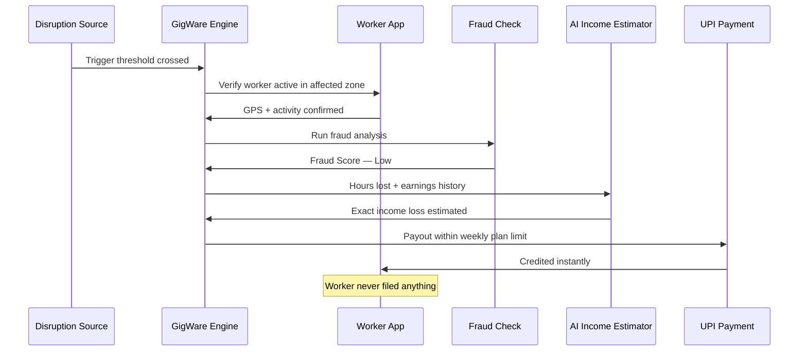
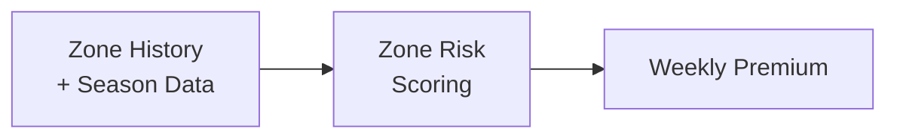
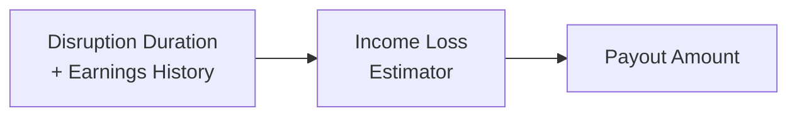
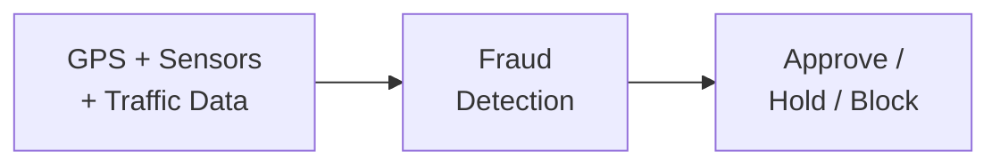
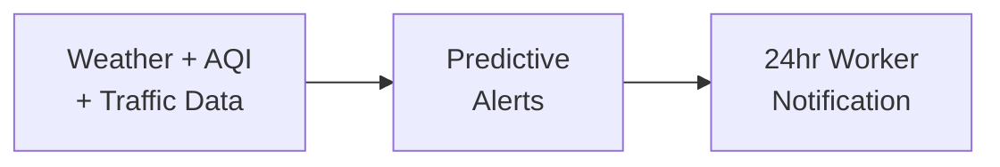

# GigWare — Parametric Income Insurance for Food Delivery Partners

> Every monsoon, every heatwave, every bandh —
> Zomato and Swiggy partners lose income they can never recover.
> No insurer covers them. GigWare does — automatically, before they even ask.

---

## Who We're Building For

| | Ravi | Priya | Arjun |
|---|---|---|---|
| **Platform** | Zomato, Bengaluru | Swiggy, Delhi | Zomato, Mumbai |
| **Daily Earnings** | ₹600–₹900 | ₹500–₹800 | ₹700–₹1,000 |
| **Disruption** | Heavy monsoon rain | Extreme heat + AQI 400+ | Local strike + curfew |
| **Without GigWare** | ₹240 on a ₹800 day | Forced off-road by 1pm | Zero deliveries, rent due |
| **With GigWare** | ₹460 estimated loss — paid instantly | ₹310 estimated loss — paid instantly | ₹550 estimated loss — paid instantly |

> One product. Three cities. Three disruptions. Zero claims filed.

---

## How GigWare Works

> Disruption hits. GigWare detects, verifies, estimates, and pays.
> **They deliver. We protect what they earn.**

---

## Parametric Triggers — What Sets Off a Claim

No forms. No assessors. Claims fire automatically when a real-time verified event crosses a defined threshold 
in the worker's active zone.

| Trigger | Threshold | Data Source |
|---|---|---|
| Heavy Rain | > 30mm/hr in active zone | Open-Meteo |
| Extreme Heat | > 43°C for 3+ consecutive hrs | Open-Meteo  |
| Severe AQI | > 400 Severe+ | OpenAQ API | 
| Flooding | Active flood warning issued | Open-Meteo | 
| Curfew / Strike | Verified shutdown confirmed | Google News RSS | 

**Strike & curfew detection:**
GigWare scans Google News RSS every 15 mins for keywords like "bandh", "curfew", and "Section 144". A trigger only fires when 85% confidence
is reached across multiple credible sources — no rumours, no false payouts.

> Coverage is income loss only.
> Vehicle damage, health, and accidents are strictly excluded.

---

## Weekly Premium Model

Gig workers earn week to week — GigWare is priced the same way.

| Plan | Weekly Premium | Weekly Cap | 
|---|---|---|
| Basic Shield | ₹49 | ₹1,500 | 
| Standard Shield | ₹79 | ₹2,500 |
| Full Shield | ₹99 | ₹3,500 | 

Premium is auto-debited weekly via UPI or bank account — no manual action needed.
Payouts are processed via Razorpay — supporting UPI, net banking, and wallet transfers.
GigWare recommends the right plan during onboarding based on the
worker's zone risk level and average weekly earnings.

> If estimated loss exceeds the weekly cap, the worker receives the full weekly cap amount.
> Plan limits are shown clearly at signup — no hidden terms.

---

## Platform Choice

| | Worker App | Admin Dashboard |
|---|---|---|
| **Platform** | React Native (Mobile) | React.js (Web) |
| **Why** | GPS, UPI, and push alerts are mobile-native | Fraud queues and analytics need screen space |
| **Key Features** | Plan selection, zone status, payout alerts | Loss ratios, fraud review, claim history |

---

## AI/ML Architecture

AI powers four things in GigWare — pricing, payout, fraud detection, and prediction.

---

### Module 1 — Zone Risk Scoring

| | |
|---|---|
| **Input** | Zone's historical rainfall, AQI, flood frequency, seasonal patterns |
| **Model** | XGBoost classifier |
| **Output** | Risk score — Low / Medium / High |
| **Action** | Dynamically recalculates the worker's weekly premium every week based on zone risk and season |

---

### Module 2 — Income Loss Estimator

| | |
|---|---|
| **Input** | Disruption duration, severity, worker's average hourly earnings |
| **Model** | Regression model |
| **Output** | Exact income lost in rupees |
| **Action** | Payout amount — capped at weekly plan limit |

---

### Module 3 — Intelligent Fraud Detection

| | |
|---|---|
| **Input** | GPS, accelerometer, order attempts, claim history, Google Maps traffic data, Zomato/Swiggy platform activity signals |
| **Model** | Anomaly detection model |
| **Output** | Fraud score 0–100 |
| **Action** | Below 40 → approved. 41–70 → soft hold. Above 70 → blocked |

- **Location validation** — GPS cross-checked against Google Maps traffic data
- **Duplicate prevention** — same disruption cannot trigger more than one payout per worker
- **Ring detection** — claims spiking 5x the zone baseline raises scrutiny for all claims in that zone. Genuine workers still 
  auto-approve based on their individual fraud score.

---

### Module 4 — Predictive Disruption Alerts

Using weather, AQI, and traffic patterns, GigWare notifies workers
24 hours before a likely disruption so they can maximise earnings before it hits.

> GigWare doesn't just protect what workers earn.
> It helps them earn more.

---
