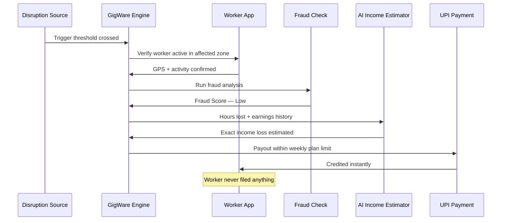
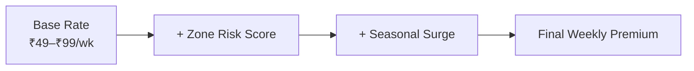
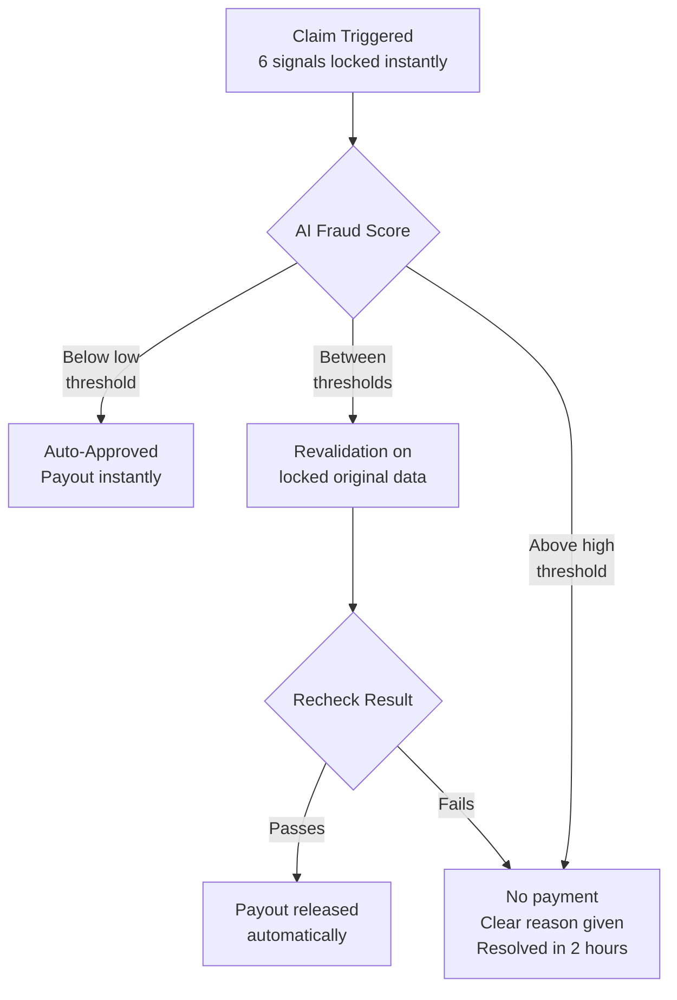
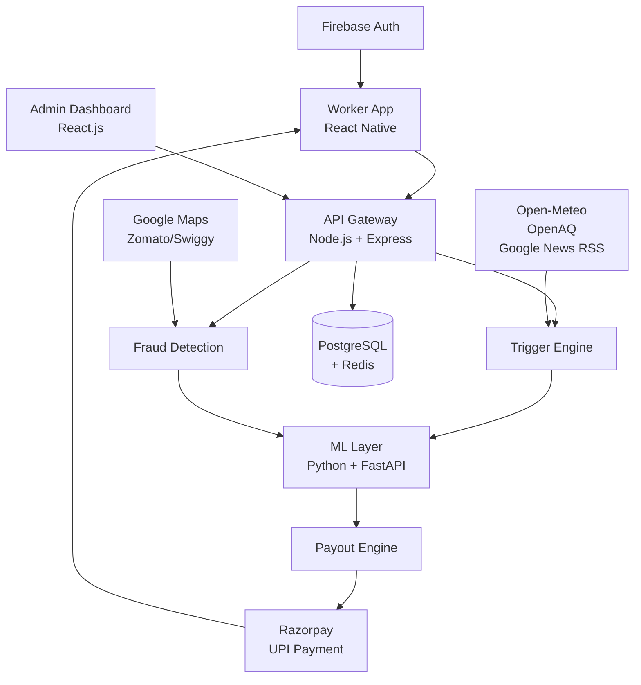

# GigWare — Parametric Income Insurance for Food Delivery Partners

> Every monsoon, every heatwave, every bandh —
> Zomato and Swiggy partners lose income they can never recover.
> No insurer covers them. GigWare does — automatically, before they even ask.

---

## Who We're Building For

| | Ravi | Priya | Arjun |
|---|---|---|---|
| **Platform** | Zomato, Bengaluru | Swiggy, Delhi | Zomato, Mumbai |
| **Daily Earnings** | ₹600–₹900 | ₹500–₹800 | ₹700–₹1,000 |
| **Disruption** | Heavy monsoon rain | Extreme heat + AQI 400+ | Local strike + curfew |
| **Without GigWare** | ₹240 on a ₹800 day | Forced off-road by 1pm | Zero deliveries, rent due |
| **With GigWare** | ₹460 estimated loss — paid instantly | ₹310 estimated loss — paid instantly | ₹550 estimated loss — paid instantly |

> One product. Three cities. Three disruptions. Zero claims filed.

---

## How GigWare Works

> Disruption hits. GigWare detects, verifies, estimates, and pays.
> **They deliver. We protect what they earn.**

---

## Parametric Triggers — What Sets Off a Claim

No forms. No assessors. Claims fire automatically when a real-time
verified event crosses a defined threshold in the worker's active zone.

| Trigger | Threshold | Data Source |
|---|---|---|
| Heavy Rain | > 30mm/hr in active zone | Open-Meteo |
| Extreme Heat | > 43°C for 3+ consecutive hrs | Open-Meteo |
| Severe AQI | > 400 Severe+ | OpenAQ API |
| Flooding | Active flood warning issued | Open-Meteo |
| Curfew / Strike | Verified shutdown confirmed | Google News RSS |

**Strike & curfew detection:**
GigWare scans Google News RSS every 15 mins for keywords like
"bandh", "curfew", and "Section 144". A trigger only fires when
85% confidence is reached across multiple credible sources —
no rumours, no false payouts.

> Coverage is income loss only.
> Vehicle damage, health, and accidents are strictly excluded.

---

## Weekly Premium Model

Gig workers earn week to week — GigWare is priced the same way.

| Plan | Weekly Premium | Weekly Cap | Days Covered |
|---|---|---|---|
| Basic Shield | ₹49 | ₹1,500 | Up to 3 days |
| Standard Shield | ₹79 | ₹2,500 | Up to 5 days |
| Full Shield | ₹99 | ₹3,500 | Up to 7 days |

Premium is auto-debited weekly via UPI or bank account — no manual action needed.
Payouts are processed via Razorpay — supporting UPI, net banking, and wallet transfers.
GigWare recommends the right plan during onboarding based on the
worker's zone risk level and average weekly earnings.

> GigWare pays exactly what was lost —
> but never more than your plan's weekly limit.
> Plan limits are shown clearly at signup — no hidden terms.

---

## Platform Choice

| | Worker App | Admin Dashboard |
|---|---|---|
| **Platform** | React Native (Mobile) | React.js (Web) |
| **Why** | GPS, UPI, and push alerts are mobile-native | Fraud queues and analytics need screen space |
| **Key Features** | Plan selection, zone status, payout alerts | Loss ratios, fraud review, claim history |

> Mobile is where the data is born. Web is where the data is understood.

---

## AI/ML Architecture

AI powers four things in GigWare — pricing, payout, fraud detection, and prediction.

---

### Module 1 — Zone Risk Scoring

| | |
|---|---|
| **Input** | Zone's historical rainfall, AQI, flood frequency, seasonal patterns |
| **Model** | XGBoost classifier |
| **Output** | Risk score — Low / Medium / High |
| **Action** | Dynamically recalculates weekly premium every week based on zone risk and season |

---

### Module 2 — Income Loss Estimator

| | |
|---|---|
| **Input** | Disruption duration, severity, worker's average hourly earnings |
| **Model** | Regression model |
| **Output** | Exact income lost in rupees |
| **Action** | Payout amount — capped at weekly plan limit |

---

### Module 3 — Intelligent Fraud Detection

| | |
|---|---|
| **Input** | GPS, accelerometer, order attempts, claim history, Google Maps traffic data, Zomato/Swiggy platform activity |
| **Model** | Anomaly detection model |
| **Output** | Fraud score 0–100 — thresholds dynamically set by AI based on zone risk and seasonal fraud patterns |
| **Action** | Below low threshold → approved. Between thresholds → revalidation. Above high threshold → blocked |

- **Location validation** — GPS cross-checked against Google Maps traffic data
- **Duplicate prevention** — same disruption cannot trigger more than one payout per worker
- **Ring detection** — abnormal claim surge in one zone raises scrutiny for all claims in that zone

---

### Module 4 — Predictive Disruption Alerts

| | |
|---|---|
| **Input** | Historical weather, AQI, and traffic patterns |
| **Model** | Time series forecasting |
| **Output** | Disruption probability for next 24 hours |
| **Action** | Push notification sent to workers in high risk zones |

> GigWare doesn't just protect what workers earn.
> It helps them earn more.

---

## Adversarial Defense & Anti-Spoofing Strategy

> A syndicate of 500 workers. One Telegram group. One coordinated GPS spoof.
> Fake locations. Mass false payouts. A drained liquidity pool.
> GigWare was built to stop exactly this.

---

### The Core Insight

One person faking their location is easy to catch.
Hundreds doing it together is a different problem entirely.

GigWare runs two checks on every claim:
- **Individual check** — was this worker genuinely present during the disruption?
- **Group check** — is a coordinated attack happening across the zone?

A genuine worker passes both automatically.
A fraud ring gets caught by the group check — every time.

---

### 1. Anti-Spoofing — 6 Layer Defense

| Layer | How It Works | Genuine Worker | Bad Actor |
|---|---|---|---|
| **Mock Location Flag** | Android built-in flag — detects if fake GPS is enabled | Off | Blocked instantly |
| **Device Integrity** | Play Integrity API (Android) / Apple App Attest (iOS) | Clean device | Tampered device detected |
| **Cell Tower** | Phone's connected tower must match GPS location | Matches claimed zone | Matches home — not the zone |
| **Movement Pattern** | Real movement is irregular — fake GPS moves perfectly | Natural movement | Robotic straight lines |
| **WiFi Cross-check** | Phone scans nearby WiFi — must match claimed zone | Zone networks visible | Only home networks visible |
| **Platform Activity** | Platform confirms worker was online and attempting orders | Active on Zomato/Swiggy | Never logged in |
---

### 2. Detecting a Coordinated Ring

| Signal | Why It Exposes a Ring |
|---|---|
| Claim velocity | Hundreds of claims in minutes — impossible naturally |
| UPI destination clustering | Many workers routing payouts to same 2–3 accounts |
| Device fingerprint similarity | Same spoofing app — identical digital footprint |
| Registration wave | Mass signups weeks before the attack |
| Zero platform activity | Hundreds of workers — not one delivery attempted |

---

### 3. Protecting Honest Workers

All 6 signals are captured and locked the moment a claim is triggered.
Fraud thresholds are dynamically set by AI — not hardcoded.

> Fraudsters cannot game the recheck by turning off mock GPS
> or logging into Zomato after being flagged —
> the original locked data is what gets rechecked, not new data.

- Network drop during bad weather → data locked locally → syncs and pays automatically.

---
## Tech Stack

| Layer | Technology | Language | Why |
|---|---|---|---|
| Worker App | React Native | JavaScript | Cross-platform, GPS, UPI, push notifications |
| Admin Dashboard | React.js | JavaScript | Fast analytics and fraud review dashboard |
| Backend | Node.js + Express | JavaScript | Real-time trigger processing, fast REST APIs |
| ML Models | Python + FastAPI | Python | Best for XGBoost, regression, anomaly detection |
| Database | PostgreSQL | SQL | Reliable, handles policies and claims perfectly |
| Cache | Redis | — | Fast zone trigger lookups, reduces DB load |
| Auth | Firebase Auth | — | Phone OTP — perfect for delivery workers |
| Payments | Razorpay Sandbox | — | UPI, net banking, wallet — free test mode |
| Weather + Flood | Open-Meteo | — | Free, unlimited calls, all Indian cities |
| AQI | OpenAQ API | — | Free, official India pollution data |
| Strike Detection | Google News RSS | — | Free, real-time Indian news scanning |
| Hosting | Render + Vercel | — | Both free tiers, reliable deployment |

---

## System Architecture

---

## Development Plan

| Phase | What We Build | Timeline |
|---|---|---|
| Phase 1 - Foundation | Persona design, trigger logic, anti-spoofing architecture | Mar 4 – Mar 20 ✅ |
| Phase 2 - Core Build | Worker onboarding, trigger engine, AI income estimator | Mar 21 – Apr 4 |
| Phase 3 - Intelligence | Fraud detection, UPI payouts, worker app + admin dashboard | Apr 5 – Apr 17 |

> *GigWare — Because every delivery partner deserves a safety net that pays itself.*

---
> Built for DEVTrails 2026 · Guidewire University Hackathon · Phase 1 Submission

---
