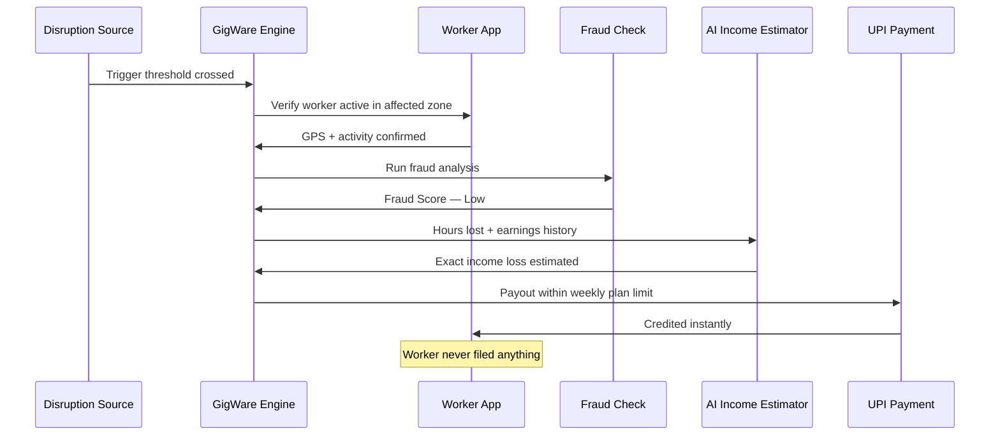
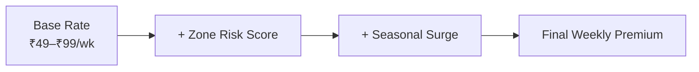
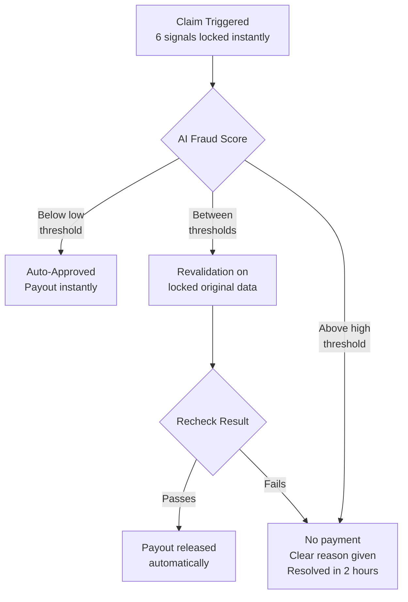
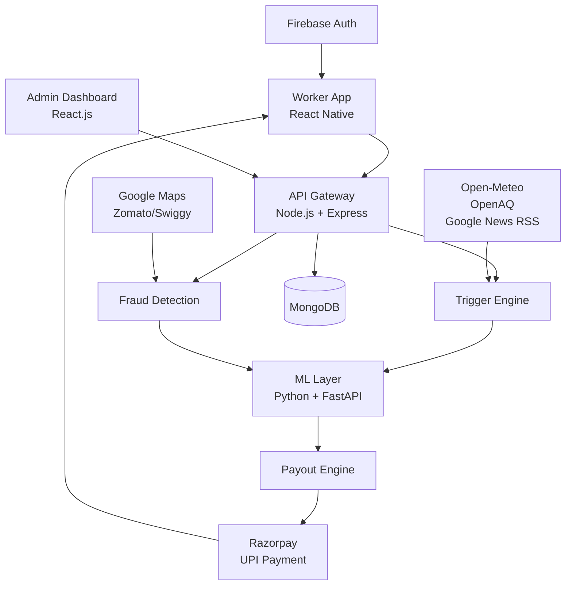

# GigWare — AI-Powered Parametric Income Insurance for Gig Workers

> Every monsoon, every heatwave, every bandh —
> Zomato and Swiggy partners lose income they can never recover.
> No insurer covers them. GigWare does — automatically, before they even ask.

> Built for DEVTrails 2026 · Guidewire University Hackathon · Phase 2 Submission

---

## Who We're Building For

| | Ravi | Priya | Arjun |
|---|---|---|---|
| **Platform** | Zomato, Bengaluru | Swiggy, Delhi | Zomato, Mumbai |
| **Daily Earnings** | ₹600–₹900 | ₹500–₹800 | ₹700–₹1,000 |
| **Disruption** | Heavy monsoon rain | Extreme heat + AQI 400+ | Local strike + curfew |
| **Without GigWare** | ₹240 on a ₹800 day | Forced off-road by 1pm | Zero deliveries, rent due |
| **With GigWare** | ₹460 estimated loss — paid instantly | ₹310 estimated loss — paid instantly | ₹550 estimated loss — paid instantly |

> One product. Three cities. Three disruptions. Zero claims filed.

---

## How GigWare Works



> Disruption hits. GigWare detects, verifies, estimates, and pays.
> **They deliver. We protect what they earn.**

---

## Parametric Triggers — What Sets Off a Claim

No forms. No assessors. Claims fire automatically when a real-time verified event crosses a defined threshold in the worker's active zone.

| Trigger | Threshold | Data Source |
|---|---|---|
| Heavy Rain | > 30mm/hr in active zone | Open-Meteo |
| Extreme Heat | > 43°C for 3+ consecutive hrs | Open-Meteo |
| Severe AQI | > 400 Severe+ | OpenAQ API |
| Flooding | Active flood warning issued | Open-Meteo |
| Curfew / Strike | Verified shutdown confirmed | Google News RSS |

**Strike & curfew detection:**
GigWare scans Google News RSS every 15 mins for keywords like "bandh", "curfew", and "Section 144". A trigger only fires when 85% confidence is reached across multiple credible sources — no rumours, no false payouts.

---

## Weekly Premium Model



| Plan | Weekly Premium | Weekly Cap | Days Covered |
|---|---|---|---|
| Basic Shield | ₹49 | ₹1,500 | Up to 3 days |
| Standard Shield | ₹79 | ₹2,500 | Up to 5 days |
| Full Shield | ₹99 | ₹3,500 | Up to 7 days |

---

## AI/ML Architecture

### Module 1 — Zone Risk Scoring
| | |
|---|---|
| **Input** | Zone's historical rainfall, AQI, flood frequency, seasonal patterns |
| **Model** | XGBoost classifier |
| **Output** | Risk score — Low / Medium / High |
| **Action** | Dynamically recalculates weekly premium every week |

### Module 2 — Income Loss Estimator
| | |
|---|---|
| **Input** | Disruption duration, severity, worker's average hourly earnings |
| **Model** | Regression model |
| **Output** | Exact income lost in rupees |
| **Action** | Payout amount — capped at weekly plan limit |

### Module 3 — Intelligent Fraud Detection
| | |
|---|---|
| **Input** | GPS, accelerometer, order attempts, claim history, Google Maps traffic data |
| **Model** | Anomaly detection model |
| **Output** | Fraud score 0–100 |
| **Action** | Below low threshold → approved. Between thresholds → revalidation. Above high threshold → blocked |

### Module 4 — Predictive Disruption Alerts
| | |
|---|---|
| **Input** | Historical weather, AQI, and traffic patterns |
| **Model** | Time series forecasting |
| **Output** | Disruption probability for next 24 hours |
| **Action** | Push notification sent to workers in high risk zones |

---

## Adversarial Defense & Anti-Spoofing Strategy

> A syndicate of 500 workers. One Telegram group. One coordinated GPS spoof.
> GigWare was built to stop exactly this.

### 1. Anti-Spoofing — 6 Layer Defense

| Layer | How It Works | Genuine Worker | Bad Actor |
|---|---|---|---|
| **Mock Location Flag** | Android built-in flag | Off | Blocked instantly |
| **Device Integrity** | Play Integrity API / Apple App Attest | Clean device | Tampered device detected |
| **Cell Tower** | Tower must match GPS location | Matches claimed zone | Matches home |
| **Movement Pattern** | Real movement is irregular | Natural movement | Robotic straight lines |
| **WiFi Cross-check** | Nearby WiFi must match claimed zone | Zone networks visible | Only home networks |
| **Platform Activity** | Worker must be online on platform | Active on Zomato/Swiggy | Never logged in |

### 2. Fraud Flow



---

## System Architecture



---

## Tech Stack

| Layer | Technology |
|---|---|
| Worker App | React Native |
| Admin Dashboard | React.js |
| Backend | Node.js + Express |
| ML Service | Python + FastAPI, XGBoost, scikit-learn |
| Database | MongoDB Atlas |
| Payments | Razorpay Sandbox |
| Weather + Flood | Open-Meteo |
| AQI | OpenAQ API |
| Strike Detection | Google News RSS |

---

## Project Structure

```
AI-POWERED-IN.../
├── admin-web/          # React admin dashboard
├── backend/            # Node.js API server
│   ├── .env.example
│   └── server.js
├── ml/                 # Python ML microservice
│   ├── main.py
│   ├── requirements.txt
│   └── models/
│       ├── fraud_xgboost.pkl
│       └── income_regressor.pkl
├── user-app/           # React user-facing app
├── prototype/          # Static HTML prototype
├── docker-compose.yml
└── README.md
```

---

# Running Locally(INTRUCTIONS TO RUN THE SOLUTION LOCALLY)

### Prerequisites

- [Docker](https://www.docker.com/get-started) (v20+)
- [Docker Compose](https://docs.docker.com/compose/) (v2+)

No need to install Node.js, Python, or any other dependencies — Docker handles everything.

### 1. Clone the Repository

```bash
git clone https://github.com/camadhu06/AI-Powered-Insurance-for-India-s-Gig-Economy.git
cd AI-Powered-Insurance-for-India-s-Gig-Economy
```

### 2. Set Up Environment Variables

```bash
cp ./backend/.env.example ./backend/.env
```

Open `./backend/.env` and fill in your values:

```env
# MongoDB Atlas connection string
MONGO_URI=mongodb+srv://<your-username>:<your-password>@cluster0.mongodb.net/?appName=gigware

# Razorpay sandbox keys (https://dashboard.razorpay.com/)
RAZORPAY_KEY_ID=rzp_test_xxxxxxxxxxxxxxxx
RAZORPAY_KEY_SECRET=rzp_test_xxxxxxxxxxxxxxxx
```

> `PORT` and `ML_SERVICE_URL` are auto-configured by Docker Compose — don't change them.

### 3. Build and Run

```bash
docker-compose up --build
```

### 4. Open the sites

| Service | URL |
|---|---|
| User App | http://localhost:8081 |
| Admin Dashboard | http://localhost:3000 |
| Backend API | http://localhost:5000 |
| ML Service | http://localhost:8000 |

### 5. Stop the container

```bash
docker-compose down
```

---

## Environment Variables Reference

| Variable | Description | Required |
|---|---|---|
| `MONGO_URI` | MongoDB Atlas connection string | ✅ Yes |
| `RAZORPAY_KEY_ID` | Razorpay sandbox key ID | ✅ Yes |
| `RAZORPAY_KEY_SECRET` | Razorpay sandbox secret | ✅ Yes |
| `PORT` | Backend port (default: 5000) | Optional |
| `ML_SERVICE_URL` | ML service URL (auto-set by Docker) | Auto |

> **MongoDB Atlas:** Whitelist your IP under Atlas → Network Access → Add IP Address. To simplify testify, consider allowing access from anywhere (`0.0.0.0/0`) temporarily.

---

## Development Phases

| Phase | What We Built | Timeline |
|---|---|---|
| Phase 1 — Foundation | Persona design, trigger logic, anti-spoofing architecture | Mar 4 – Mar 20 ✅ |
| Phase 2 — Core Build | Worker onboarding, trigger engine, AI income estimator | Mar 21 – Apr 4 ✅ |
| Phase 3 — Intelligence | Fraud detection, UPI payouts, worker app + admin dashboard | Apr 5 – Apr 17 ✅ |

---

## Pitch Deck

https://drive.google.com/file/d/1merf-1kDTuGv6p7NBOiPBqF4zQ4L6crB/view?usp=drive_link

## Team

| Member | Name |
|---|---|
| Member 1 | C A Madhumita |
| Member 2 | Kerubakar B |
| Member 3 | Jeyani N |
| Member 4 | Guduru Ritesh |

---

> *GigWare — Because every delivery partner deserves a safety net that pays itself.*
